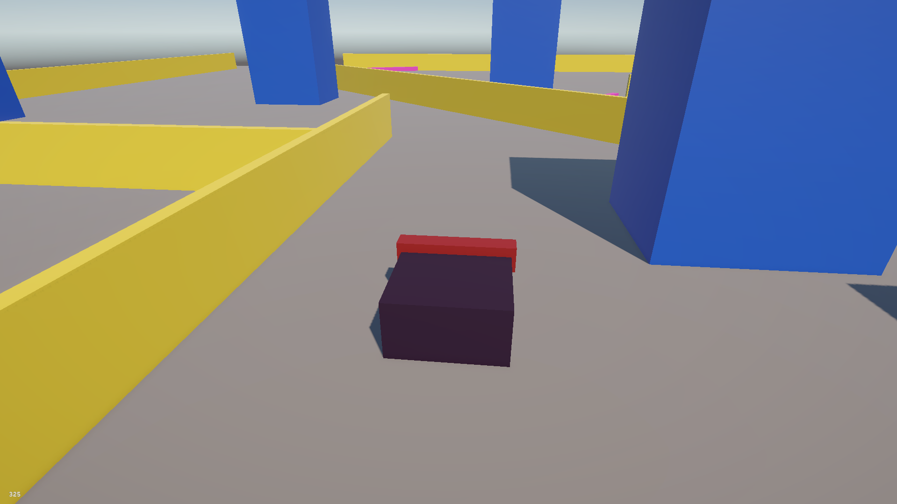
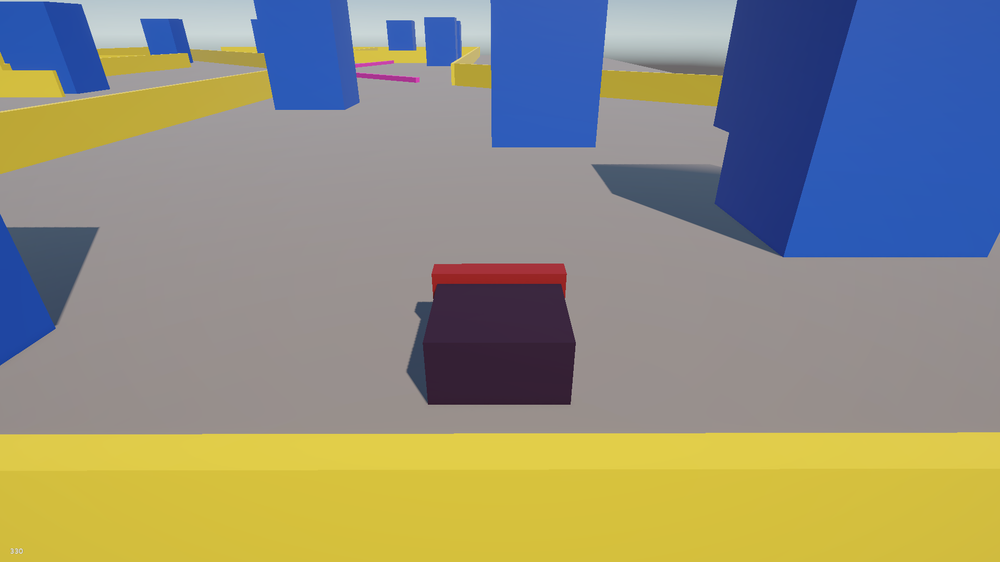
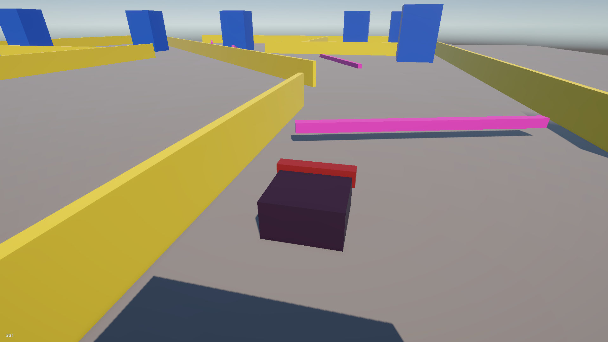

# Obstacle-Dodge

**Game Type:** Arcade / Dodge Game  
**Controls:** `W`, `A`, `S`, `D`  

## 🎮 Game Description
In **Obstacle-Dodge**, your goal is to survive as long as possible while navigating through a pre-made stage filled with a variety of obstacles. Players must use quick reflexes and strategic movement to avoid being hit by different types of obstacles.  

### 🟢 Obstacle Types
- **Spinning Obstacles:** Rotate in place, requiring precise timing to dodge.  
- **Targeting Obstacles:** Move towards the player, testing your movement skills.  
- **Standing Obstacles:** Static obstacles that require careful navigation.  

### ⌨ Controls
- `W` – Move Up  
- `A` – Move Left  
- `S` – Move Down  
- `D` – Move Right  

### ⚡ Features
- Pre-made challenging stage layout.  
- Multiple obstacle types for varied difficulty.  
- Simple and intuitive WASD controls.  

### 🛠 Technologies Used
- Unity / Python / Pygame (replace with your tech)  
- Libraries for graphics, physics, or input handling (if any)  

### 📈 Objective
Survive as long as possible without hitting obstacles. The game tests your reflexes and movement strategy.  

### 📸 Screenshot / GIF

